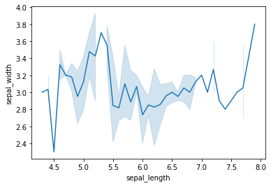
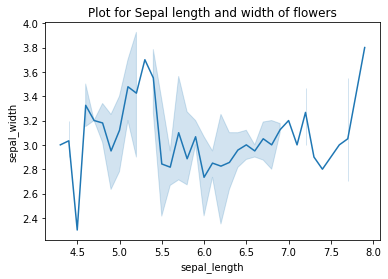
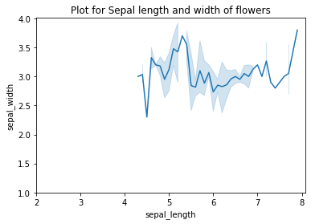
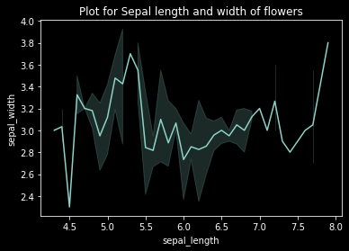
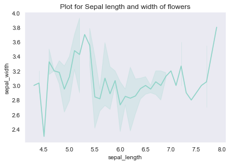
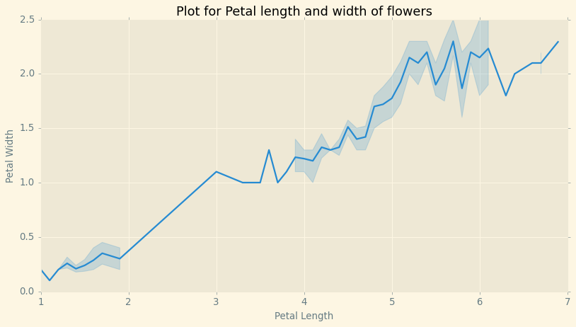

# Line Plot
### Importing libraries


```python
import seaborn as sns
import matplotlib.pyplot as plt
```

### Loading data set from built-in seaborn datasets


```python
flower = sns.load_dataset("iris")
flower
```


<div>
<style scoped>
    .dataframe tbody tr th:only-of-type {
        vertical-align: middle;
    }

    .dataframe tbody tr th {
        vertical-align: top;
    }

    .dataframe thead th {
        text-align: right;
    }
</style>
<table border="1" class="dataframe">
  <thead>
    <tr style="text-align: right;">
      <th></th>
      <th>sepal_length</th>
      <th>sepal_width</th>
      <th>petal_length</th>
      <th>petal_width</th>
      <th>species</th>
    </tr>
  </thead>
  <tbody>
    <tr>
      <th>0</th>
      <td>5.1</td>
      <td>3.5</td>
      <td>1.4</td>
      <td>0.2</td>
      <td>setosa</td>
    </tr>
    <tr>
      <th>1</th>
      <td>4.9</td>
      <td>3.0</td>
      <td>1.4</td>
      <td>0.2</td>
      <td>setosa</td>
    </tr>
    <tr>
      <th>2</th>
      <td>4.7</td>
      <td>3.2</td>
      <td>1.3</td>
      <td>0.2</td>
      <td>setosa</td>
    </tr>
    <tr>
      <th>3</th>
      <td>4.6</td>
      <td>3.1</td>
      <td>1.5</td>
      <td>0.2</td>
      <td>setosa</td>
    </tr>
    <tr>
      <th>4</th>
      <td>5.0</td>
      <td>3.6</td>
      <td>1.4</td>
      <td>0.2</td>
      <td>setosa</td>
    </tr>
    <tr>
      <th>...</th>
      <td>...</td>
      <td>...</td>
      <td>...</td>
      <td>...</td>
      <td>...</td>
    </tr>
    <tr>
      <th>145</th>
      <td>6.7</td>
      <td>3.0</td>
      <td>5.2</td>
      <td>2.3</td>
      <td>virginica</td>
    </tr>
    <tr>
      <th>146</th>
      <td>6.3</td>
      <td>2.5</td>
      <td>5.0</td>
      <td>1.9</td>
      <td>virginica</td>
    </tr>
    <tr>
      <th>147</th>
      <td>6.5</td>
      <td>3.0</td>
      <td>5.2</td>
      <td>2.0</td>
      <td>virginica</td>
    </tr>
    <tr>
      <th>148</th>
      <td>6.2</td>
      <td>3.4</td>
      <td>5.4</td>
      <td>2.3</td>
      <td>virginica</td>
    </tr>
    <tr>
      <th>149</th>
      <td>5.9</td>
      <td>3.0</td>
      <td>5.1</td>
      <td>1.8</td>
      <td>virginica</td>
    </tr>
  </tbody>
</table>
<p>150 rows × 5 columns</p>
</div>


### Drawing a line plot


```python
sns.lineplot(x = "sepal_length", y = "sepal_width", data = flower)
plt.show()
```


    

    


### Adding title


```python
import seaborn as sns
import matplotlib.pyplot as plt

flower = sns.load_dataset("iris")

sns.lineplot(x = "sepal_length", y = "sepal_width", data = flower)
plt.title("Plot for Sepal length and width of flowers") #adding title
plt.show()
```


    

    


### Adding limits


```python
import seaborn as sns
import matplotlib.pyplot as plt

flower = sns.load_dataset("iris")

sns.lineplot(x = "sepal_length", y = "sepal_width", data = flower)
plt.title("Plot for Sepal length and width of flowers")
plt.xlim(2) # adjusting x limit
plt.ylim(1) # adjusting y limit
plt.show()
```


    

    


### Setting Style with matplotlib


```python
from matplotlib import style

print(plt.style.available)
```

    ['Solarize_Light2', '_classic_test_patch', 'bmh', 'classic', 'dark_background', 'fast', 'fivethirtyeight', 'ggplot', 'grayscale', 'seaborn', 'seaborn-bright', 'seaborn-colorblind', 'seaborn-dark', 'seaborn-dark-palette', 'seaborn-darkgrid', 'seaborn-deep', 'seaborn-muted', 'seaborn-notebook', 'seaborn-paper', 'seaborn-pastel', 'seaborn-poster', 'seaborn-talk', 'seaborn-ticks', 'seaborn-white', 'seaborn-whitegrid', 'tableau-colorblind10']
    


```python
sns.lineplot(x = "sepal_length", y = "sepal_width", data = flower)
plt.title("Plot for Sepal length and width of flowers")
plt.style.use("dark_background")
plt.show()
```


    

    


### Setting style with seaborn
The set_style() function is used to set the theme for the plot. It can accept the following values - dark, white, whitegrid, darkgrid and tickers. The dark and darkgrid parameters provide a grey background without and with grids, respectively. Similarly, we can conclude for the white and whitegrid parameters.


```python
import seaborn as sns
import matplotlib.pyplot as plt

flower = sns.load_dataset("iris")

sns.lineplot(x = "sepal_length", y = "sepal_width", data = flower)
sns.set_style("dark")
plt.title("Plot for Sepal length and width of flowers")
plt.show()
```


    

    


### Figure Size


```python
import seaborn as sns
import matplotlib.pyplot as plt

flower = sns.load_dataset("iris")

plt.figure(figsize=(12,6))

sns.lineplot(x = "petal_length", y = "petal_width", data = flower)
plt.title("Plot for Petal length and width of flowers")
plt.xlabel("Petal Length")
plt.ylabel("Petal Width")
plt.style.use("Solarize_Light2")

plt.show()
```


    

    


```python

```
