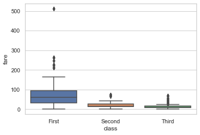
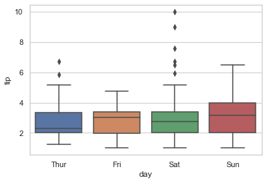
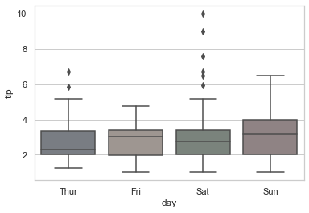
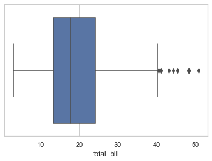
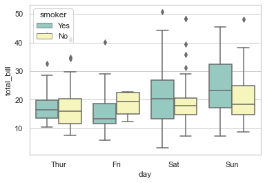
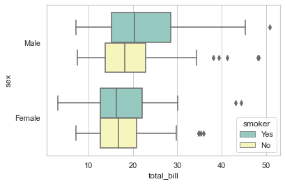
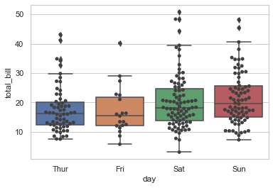

# Barplot


```python
# Import library
import seaborn as sns

# Canvas (Baloon Board)
sns.set(style = "whitegrid")

# Import data
titanic = sns.load_dataset("titanic")

# Plot
sns.boxplot(x = "class", y = "fare", data = titanic)
```


    <AxesSubplot:xlabel='class', ylabel='fare'>


    

    


```python
# Import library
import seaborn as sns

# Canvas (Baloon Board)
sns.set(style = "whitegrid")

# Import data
tips = sns.load_dataset("tips")
tips
```


<div>
<style scoped>
    .dataframe tbody tr th:only-of-type {
        vertical-align: middle;
    }

    .dataframe tbody tr th {
        vertical-align: top;
    }

    .dataframe thead th {
        text-align: right;
    }
</style>
<table border="1" class="dataframe">
  <thead>
    <tr style="text-align: right;">
      <th></th>
      <th>total_bill</th>
      <th>tip</th>
      <th>sex</th>
      <th>smoker</th>
      <th>day</th>
      <th>time</th>
      <th>size</th>
    </tr>
  </thead>
  <tbody>
    <tr>
      <th>0</th>
      <td>16.99</td>
      <td>1.01</td>
      <td>Female</td>
      <td>No</td>
      <td>Sun</td>
      <td>Dinner</td>
      <td>2</td>
    </tr>
    <tr>
      <th>1</th>
      <td>10.34</td>
      <td>1.66</td>
      <td>Male</td>
      <td>No</td>
      <td>Sun</td>
      <td>Dinner</td>
      <td>3</td>
    </tr>
    <tr>
      <th>2</th>
      <td>21.01</td>
      <td>3.50</td>
      <td>Male</td>
      <td>No</td>
      <td>Sun</td>
      <td>Dinner</td>
      <td>3</td>
    </tr>
    <tr>
      <th>3</th>
      <td>23.68</td>
      <td>3.31</td>
      <td>Male</td>
      <td>No</td>
      <td>Sun</td>
      <td>Dinner</td>
      <td>2</td>
    </tr>
    <tr>
      <th>4</th>
      <td>24.59</td>
      <td>3.61</td>
      <td>Female</td>
      <td>No</td>
      <td>Sun</td>
      <td>Dinner</td>
      <td>4</td>
    </tr>
    <tr>
      <th>...</th>
      <td>...</td>
      <td>...</td>
      <td>...</td>
      <td>...</td>
      <td>...</td>
      <td>...</td>
      <td>...</td>
    </tr>
    <tr>
      <th>239</th>
      <td>29.03</td>
      <td>5.92</td>
      <td>Male</td>
      <td>No</td>
      <td>Sat</td>
      <td>Dinner</td>
      <td>3</td>
    </tr>
    <tr>
      <th>240</th>
      <td>27.18</td>
      <td>2.00</td>
      <td>Female</td>
      <td>Yes</td>
      <td>Sat</td>
      <td>Dinner</td>
      <td>2</td>
    </tr>
    <tr>
      <th>241</th>
      <td>22.67</td>
      <td>2.00</td>
      <td>Male</td>
      <td>Yes</td>
      <td>Sat</td>
      <td>Dinner</td>
      <td>2</td>
    </tr>
    <tr>
      <th>242</th>
      <td>17.82</td>
      <td>1.75</td>
      <td>Male</td>
      <td>No</td>
      <td>Sat</td>
      <td>Dinner</td>
      <td>2</td>
    </tr>
    <tr>
      <th>243</th>
      <td>18.78</td>
      <td>3.00</td>
      <td>Female</td>
      <td>No</td>
      <td>Thur</td>
      <td>Dinner</td>
      <td>2</td>
    </tr>
  </tbody>
</table>
<p>244 rows × 7 columns</p>
</div>


```python
# Import library
import seaborn as sns

# Canvas (Baloon Board)
sns.set(style = "whitegrid")

# Import data
tips = sns.load_dataset("tips")

# Plot
sns.boxplot(x = "day", y = "tip", data = tips)
```


    <AxesSubplot:xlabel='day', ylabel='tip'>


    

    


### Customizing Saturation


```python
# Import library
import seaborn as sns

# Canvas (Baloon Board)
sns.set(style = "whitegrid")

# Import data
tips = sns.load_dataset("tips")

# Plot
sns.boxplot(x = "day", y = "tip", data = tips,
            saturation = 0.1 )
```


    <AxesSubplot:xlabel='day', ylabel='tip'>


    

    


### Describe function for summary stats


```python
# Import library
import seaborn as sns
import pandas as pd
import numpy as np

# Canvas (Baloon Board)
sns.set(style = "whitegrid")

# Import data
tips = sns.load_dataset("tips")
tips.describe() #Summary Stats
```


<div>
<style scoped>
    .dataframe tbody tr th:only-of-type {
        vertical-align: middle;
    }

    .dataframe tbody tr th {
        vertical-align: top;
    }

    .dataframe thead th {
        text-align: right;
    }
</style>
<table border="1" class="dataframe">
  <thead>
    <tr style="text-align: right;">
      <th></th>
      <th>total_bill</th>
      <th>tip</th>
      <th>size</th>
    </tr>
  </thead>
  <tbody>
    <tr>
      <th>count</th>
      <td>244.000000</td>
      <td>244.000000</td>
      <td>244.000000</td>
    </tr>
    <tr>
      <th>mean</th>
      <td>19.785943</td>
      <td>2.998279</td>
      <td>2.569672</td>
    </tr>
    <tr>
      <th>std</th>
      <td>8.902412</td>
      <td>1.383638</td>
      <td>0.951100</td>
    </tr>
    <tr>
      <th>min</th>
      <td>3.070000</td>
      <td>1.000000</td>
      <td>1.000000</td>
    </tr>
    <tr>
      <th>25%</th>
      <td>13.347500</td>
      <td>2.000000</td>
      <td>2.000000</td>
    </tr>
    <tr>
      <th>50%</th>
      <td>17.795000</td>
      <td>2.900000</td>
      <td>2.000000</td>
    </tr>
    <tr>
      <th>75%</th>
      <td>24.127500</td>
      <td>3.562500</td>
      <td>3.000000</td>
    </tr>
    <tr>
      <th>max</th>
      <td>50.810000</td>
      <td>10.000000</td>
      <td>6.000000</td>
    </tr>
  </tbody>
</table>
</div>


### Indexing


```python
# Import library
import seaborn as sns

# Canvas (Baloon Board)
sns.set(style = "whitegrid")

# Import data
tips = sns.load_dataset("tips")

# Plot
sns.boxplot(x = tips["total_bill"]) # indexing
```


    <AxesSubplot:xlabel='total_bill'>


    

    


### Adding palette and dodge


```python
# Import library
import seaborn as sns

# Canvas (Baloon Board)
sns.set(style = "whitegrid")

# Import data
tips = sns.load_dataset("tips")

#Plot
sns.boxplot(x = "day", y = "total_bill", hue = "smoker",
            palette = "Set3", data = tips, dodge = True)
```


    <AxesSubplot:xlabel='day', ylabel='total_bill'>


    

    


### Changing orientation
It need numeric variables on y or x axis


```python
# Import library
import seaborn as sns

# Canvas (Baloon Board)
sns.set(style = "whitegrid")

# Import data
tips = sns.load_dataset("tips")

#Plot
sns.boxplot(x = "total_bill", y = "sex", hue = "smoker",
            palette = "Set3", data = tips, dodge = True, orient = "h")
```


    <AxesSubplot:xlabel='total_bill', ylabel='sex'>


    

    


### Boxplot with swarmlot


```python
# Import library
import seaborn as sns

# Canvas (Baloon Board)
sns.set(style = "whitegrid")

# Import data
tips = sns.load_dataset("tips")

# Boxplot with swarmlot
sns.boxplot(x="day", y="total_bill", data=tips)
sns.swarmplot(x="day", y="total_bill", data=tips, color=".25")
```


    <AxesSubplot:xlabel='day', ylabel='total_bill'>


    

    


This is basic practic sheet by Ghulam Asghar Sajid
