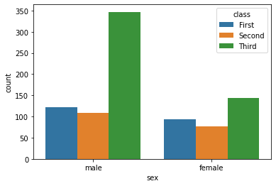
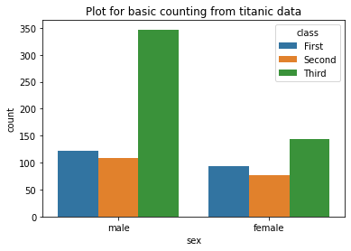

# Working on Chilla data
### Importing library


```python
import pandas as pd
```

### Importing data from local directory


```python
chilla = pd.read_csv("data_viz.csv")
print(chilla)
```

              timestamp  gender    age  location time_of_class(time)  \
    0    1/3/2022 19:09    Male  16-30  Pakistan               10:30   
    1    1/3/2022 19:09    Male  16-30  Pakistan               10:00   
    2    1/3/2022 19:09    Male  16-30  Pakistan               10:00   
    3    1/3/2022 19:09    Male  30-40  Pakistan                9:30   
    4    1/3/2022 19:09    Male  16-30      East                9:30   
    ..              ...     ...    ...       ...                 ...   
    301  1/3/2022 19:11    Male  16-30  Pakistan                9:30   
    302  1/3/2022 19:11    Male  16-30  Pakistan               10:30   
    303  1/3/2022 19:11    Male  16-30  Pakistan               10:00   
    304  1/3/2022 19:11  Female  16-30  Pakistan               10:30   
    305  1/3/2022 19:11    Male  16-30  Pakistan               10:30   
    
         duration_(min)  
    0                60  
    1                60  
    2                30  
    3                30  
    4                60  
    ..              ...  
    301              30  
    302              45  
    303              60  
    304              60  
    305              45  
    
    [306 rows x 6 columns]
    

### Importing libraries for plotting


```python
import seaborn as sns
import matplotlib.pyplot as plt
```

### Setting theme


```python
sns.set_theme(style = "ticks", color_codes = True)
```

### Plotting graph for gender


```python
plot = sns.countplot(x = "gender", hue = "age", data = chilla)
plt.show()
```


    

    


### Plotting for availibilty of time


```python
plot = sns.countplot(x = "gender", hue = "time_of_class(time)", data = chilla)
plt.show()
```


    

    


### Pairplot


```python
plot = sns.pairplot(data= chilla, hue="gender")
plt.show()
```


    

    

