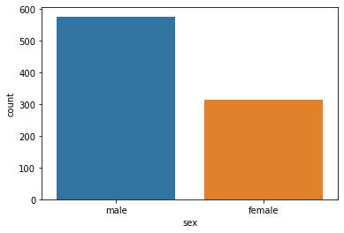

# Data Visualization
### Imprting libraries


```python
import seaborn as sns
import matplotlib.pyplot as plt
```

### Set a theme


```python
sns.set_theme(style="ticks", color_codes=True)
```

### Import data set/own data can be imported


```python
titanic = sns.load_dataset("titanic")
print(titanic)
```

         survived  pclass     sex   age  sibsp  parch     fare embarked   class  \
    0           0       3    male  22.0      1      0   7.2500        S   Third   
    1           1       1  female  38.0      1      0  71.2833        C   First   
    2           1       3  female  26.0      0      0   7.9250        S   Third   
    3           1       1  female  35.0      1      0  53.1000        S   First   
    4           0       3    male  35.0      0      0   8.0500        S   Third   
    ..        ...     ...     ...   ...    ...    ...      ...      ...     ...   
    886         0       2    male  27.0      0      0  13.0000        S  Second   
    887         1       1  female  19.0      0      0  30.0000        S   First   
    888         0       3  female   NaN      1      2  23.4500        S   Third   
    889         1       1    male  26.0      0      0  30.0000        C   First   
    890         0       3    male  32.0      0      0   7.7500        Q   Third   
    
           who  adult_male deck  embark_town alive  alone  
    0      man        True  NaN  Southampton    no  False  
    1    woman       False    C    Cherbourg   yes  False  
    2    woman       False  NaN  Southampton   yes   True  
    3    woman       False    C  Southampton   yes  False  
    4      man        True  NaN  Southampton    no   True  
    ..     ...         ...  ...          ...   ...    ...  
    886    man        True  NaN  Southampton    no   True  
    887  woman       False    B  Southampton   yes   True  
    888  woman       False  NaN  Southampton    no  False  
    889    man        True    C    Cherbourg   yes   True  
    890    man        True  NaN   Queenstown    no   True  
    
    [891 rows x 15 columns]
    

### Plot basic graph with one varibale


```python
plot = sns.countplot(x= "sex", data = titanic)
plt.show()
```


    

    


### Plot basic graph with two varibale


```python

```


    

    


### Adding Title


```python
plot = sns.countplot(x= "sex", data = titanic, hue = "class")
plot.set_title("Plot for basic counting from titanic data") # Adding title
plt.show()
```


    

    

